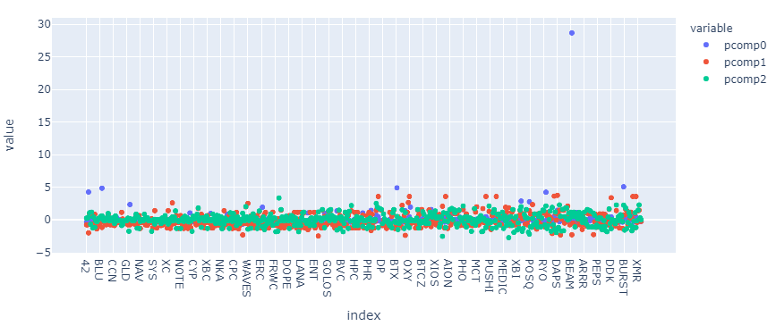
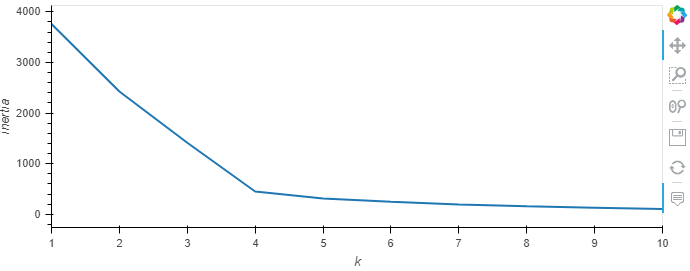
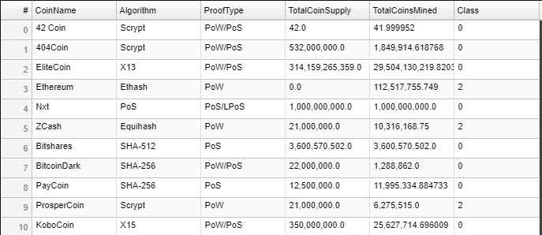
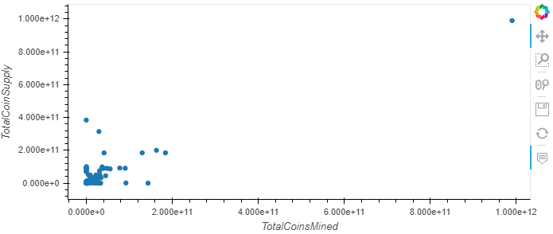

# Clustering Crypto

_[Cryptocurrencies coins by Worldspectrum](https://www.pexels.com/@worldspectrum?utm_content=attributionCopyText&utm_medium=referral&utm_source=pexels) | [Free License](https://www.pexels.com/photo-license/)_

### Background

One of our important clients, a prominent investment bank, is interested in offering a new cryptocurrencies investment portfolio for its customers, however, they are lost in the immense universe of cryptocurrencies. They asked our to help them make sense of it all by generating a report of what cryptocurrencies are available on the trading market and how they can be grouped using classification.  

In this notebook, we will put use one of the unsupervivsed learning mdoels - k-Means clustering to cluster or classify cryptocurrencies and plot our results.

the following tasks have been incorporated :

* **[Data Preprocessing](#Data-Preprocessing):** Prepare data for dimension reduction with PCA and clustering using K-Means.

* **[Reducing Data Dimensions Using PCA](#Reducing-Data-Dimensions-Using-PCA):** Reduce data dimension using the `PCA` algorithm from `sklearn`.

* **[Clustering Cryptocurrencies Using K-Means](#Clustering-Cryptocurrencies-Using-K-Means):** Predict clusters using the cryptocurrencies data using the `KMeans` algorithm from `sklearn`.

* **[Visualizing Results](#Visualizing-Results):** Create some plots and data tables to present your results.

---

#### Data Preprocessing

1. In this section, we will load the information about cryptocurrencies and perform data preprocessing tasks.  Using the `requests` library, we will retreive the necessary data from the an API endpoint from _CryptoCompare_ - `https://min-api.cryptocompare.com/data/all/coinlist`. We will save the imported data into a csv file for later use as needed. 
2. Keep only the necessary columns: 'CoinName','Algorithm','IsTrading','ProofType','TotalCoinsMined','TotalCoinSupply'
3. Keep only the cryptocurrencies that are trading.
4. Keep only the cryptocurrencies with a working algorithm.
5. Remove the `IsTrading` column.
6. Remove all cryptocurrencies with at least one null value.
7. Remove all cryptocurrencies that have no coins mined.
8. Drop all rows where there are 'N/A' text values.
9. Store the names of all cryptocurrencies in a DataFrame named `coins_name`
10. Remove the `CoinName` column.
11. Create dummy variables for all the text features, and store the resulting data in a DataFrame.
12. Using the [`StandardScaler` from `sklearn`](https://scikit-learn.org/stable/modules/generated/sklearn.preprocessing.StandardScaler.html) we will standardize all the data.

#### Reducing Data Dimensions Using PCA

Using the [`PCA` algorithm from `sklearn`](https://scikit-learn.org/stable/modules/generated/sklearn.decomposition.PCA.html) to reduce the dimensions of the  DataFrame down to three principal components.

#### Clustering Cryptocurrencies Using K-Means

We will use the [`KMeans` algorithm from `sklearn`](https://scikit-learn.org/stable/modules/generated/sklearn.cluster.KMeans.html) to cluster the cryptocurrencies using the PCA data.

The following tasks are performed:

1. Create an Elbow Curve to find the best value for `k` using the `pcs_df` DataFrame.

2. Once we define the best value for `k`, run the `Kmeans` algorithm to predict the `k` clusters for the cryptocurrencies data. 

#### Visualizing Results

In this section, we will create some data visualization to present the final results performing the following tasks:

1. Create a 3D-Scatter using Plotly Express to plot the clusters using the `clustered_df` DataFrame. 

![Crypto clusters(Resources/crypto_clusters.PNG)

2. Using `hvplot.table` to create a data table with all the current tradable cryptocurrencies. 

3. Create a scatter plot using `hvplot.scatter`, to present the clustered data about cryptocurrencies having `x="TotalCoinsMined"` and `y="TotalCoinSupply"` to contrast the number of available coins versus the total number of mined coins. 

---

